# Docker Swarm Load Balancer (AWS EC2 Cluster)

In this project, we will be going through a complete guide on deploying a Docker Swarm load balancer on a multi-node Amazon EC2 cluster. This objective is achieved using various tasks that can be deployed using Docker's command-line interface or python SDK API's. The idea is to design a load balancer that can distribute the load on different worker machines, based on the inter-arrival of requests. Using this project, you can understand the complete Docker Swarm architecture and how it can be leveraged in Amazon EC2 Linux AMI instances.

# Prerequisities

- Terminal or Command-line Interface
- Amazon AWS admin account with console access
- Basic understanding of Python 3.7
- Basic understanding of R/Rscript 4.0

# Overview

A web application has to be deployed in a containerized environment. A sample Java web application is provided in the image *"nclcloudcomputing/javabenchmarkapp"*. The
image contains an application deployed on a Tomcat application server. The application performs a prime number check on a large number, placing a load on the CPU. It listens to port 8080. URL: http://<hostname>:8080/primecheck.

Using this java web application, we will be deploying the following docker architecture as shown below.

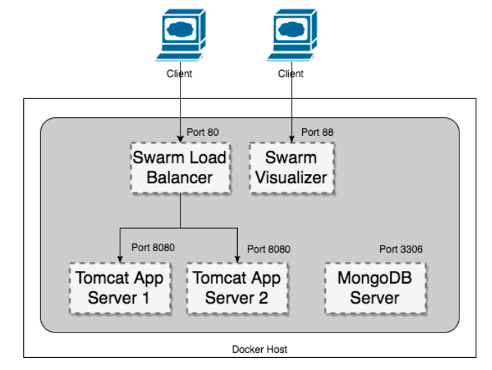

# Project Setup

Before starting with our tasks, we need to first configure our local environment and also show how to enable docker swarm on Amazon EC2 instances.

## Setting up Amazon EC2 Linux AMI instance (Manager Node)

Using your AWS account, you can create an Amazon EC2 Linux instance by using the following machine to ensure all the configuration shown below works correctly.

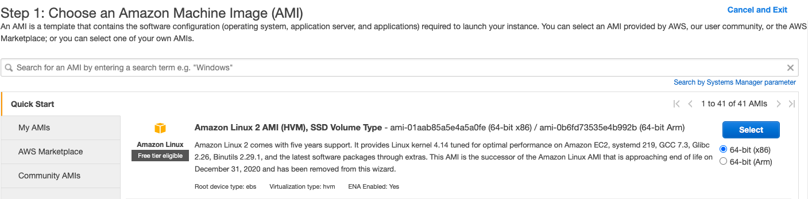

When your instance is running, connect it using SSH or direct client and install the following components as described below. If you are doing an SSH using `.pem` file, make sure to change permission by executing `chmod 400 <key_name>.pem`.

### 1. Open Required Ports

You can either open ports using AWS console GUI or using the below CLI commands.

```bash
# -- make sure to get your AWS access key and AWS secret key ready --
aws configure

# Replace with your security group id
SECURITY_GROUP_ID=<your security group id>

# port required by load balancer
aws ec2 authorize-security-group-ingress --group-id $SECURITY_GROUP_ID --protocol tcp --port 80 --cidr 0.0.0.0/0
# port required by visualizer
aws ec2 authorize-security-group-ingress --group-id $SECURITY_GROUP_ID --protocol tcp --port 88 --cidr 0.0.0.0/0
# port required by cAdvisor
aws ec2 authorize-security-group-ingress --group-id $SECURITY_GROUP_ID --protocol tcp --port 70 --cidr 0.0.0.0/0
# port required by mongodb
aws ec2 authorize-security-group-ingress --group-id $SECURITY_GROUP_ID --protocol tcp --port 3306 --cidr 0.0.0.0/0

# for enabling docker swarm discovery
aws ec2 authorize-security-group-ingress --group-id $SECURITY_GROUP_ID --protocol tcp --port 2377 --cidr 0.0.0.0/0
aws ec2 authorize-security-group-ingress --group-id $SECURITY_GROUP_ID --protocol tcp --port 7946 --cidr 0.0.0.0/0
aws ec2 authorize-security-group-ingress --group-id $SECURITY_GROUP_ID --protocol udp --port 7946 --cidr 0.0.0.0/0
aws ec2 authorize-security-group-ingress --group-id $SECURITY_GROUP_ID --protocol tcp --port 4789 --cidr 0.0.0.0/0
aws ec2 authorize-security-group-ingress --group-id $SECURITY_GROUP_ID --protocol udp --port 4789 --cidr 0.0.0.0/0
```

Using the above commands, all the ports will be opened for traffic from outside.

### 2. Install Docker (Linux AMI)

We can easily install docker on Amazon EC2 Linux AMI instances using `amazon-linux-extras` as shown using the below CLI commands.

```bash
# update yum
sudo yum update -y
# install docker
sudo amazon-linux-extras install docker
# start docker service
sudo service docker start
# get permission to current user
sudo usermod -a -G docker ec2-user
# exit shell then connect again
docker info
```

If docker is installed properly and running, then you should see the following information in your EC2 SSH shell.

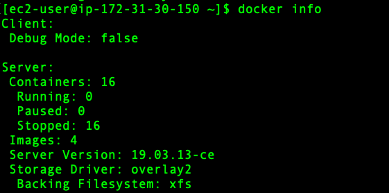

Great!! So, now you have running docker daemon on your Linux EC2 instance.

### 3. Install Python 3.7 (Linux AMI)

Again, we can install Python 3.7 using `yum` which we will be using for docker python SDK as shown using the below CLI command.

```bash
# install python 3.7
sudo yum install python37
```

### 4. Install R 4.0 (Linux AMI)

We will also be installing R 4.0 for generating `ggplot2` graphs by dumping CPU and memory statistics of our load balancer in `mongodb`. This can be installed using the below CLI commands.

```bash
# install R core
sudo amazon-linux-extras install R4
# For dependency of devtools in R
sudo yum install -y libcurl-devel openssl-devel
# Make Accessible to /usr/local/lib/R/site-library
sudo chmod 777 -R /usr/lib64/R/library
# For R Studio Server
wget https://download2.rstudio.org/rstudio-server-rhel-1.1.383-x86_64.rpm
sudo yum install -y --nogpgcheck rstudio-server-rhel-1.1.383-x86_64.rpm
sudo rm rstudio-server-rhel1.1.383-x86_64.deb
# Make Accessible to /usr/local/lib/R/site-library
sudo chmod 777 -R /usr/lib64/R/library

# install ggplot2
R -e "install.packages('ggplot2', repos='http://cran.rstudio.com/')"
# install mongolite
sudo yum install cyrus-sasl-devel
R -e "install.packages('mongolite', repos='http://cran.rstudio.com/')"
```

### 5. Initialize Docker Swarm

Now, we will initialize docker swarm on our manager node, so that other worker nodes can be connected with our manager node. First, we need to get our ethernet address. This can be done using the below command.

```bash
# get ethernet address
ifconfig eth0
```


Next, we can initialise the docker swarm using the above advertising address as shown below.

```bash
# initilize docker swarm
docker swarm init --advertise-addr 172.31.30.150
```

This command will provide the join token. You can save it somewhere. It will be used to connect the worker nodes.

### 6. Upload python scripts and create a virtual environment

Finally, we will upload our entire python SDK scripts package in our manager mode. The package can be found in this GitHub URL: [https://github.com/abhinavcreed13/docker-load-balancer-ec2/blob/main/package/docker-project-aws.zip](https://github.com/abhinavcreed13/docker-load-balancer-ec2/blob/main/package/docker-project-aws.zip){:target="_blank"}.

This package can be uploaded into our EC2 instance using `scp` command as shown below.

```bash
# upload package into the manager node using a new terminal window
scp -i "key.pem" /Users/abhinavcreed/projects/docker-project-aws.zip ec2-user@ec2-18-225-37-144.us-east-2.compute.amazonaws.com
```

Then, this package can be unpacked inside EC2 instance using an SSH client and python packages can be installed as shown below.

```bash
# unzip package
unzip docker-project-aws.zip

cd docker-project-aws

# create dockerenv virtual environment
python3 -m venv dockerenv

# activate virtual environment
source dockerenv/bin/activate

# install packages
pip install -r requirements.txt
```

After everything is properly installed and uploaded, you should have the following files in your manager node.

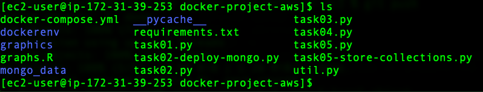

## Setting up Amazon EC2 Linux AMI instance (Worker Nodes)

You can again use Amazon EC2 Linux 2 AMI machines to create 2 or more than 2 worker nodes as shown below.

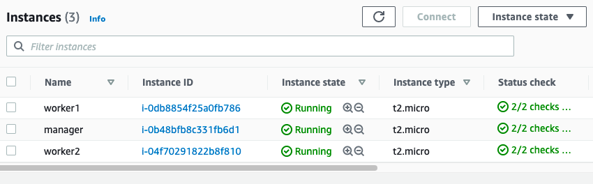

Once your worker node is running, connect it via an SSH client and install the following components.

- Open the required ports using the commands as shown in the manager node setup.
- Install Docker using CLI as shown in the manager node setup.
- Install Python 3.7 as shown in the manager node setup.
- Join the Docker Swarm using the join token provided by the manager node.
    ```bash
    # join the manager node - token will be similar to shown below
    docker swarm join --token SWMTKN-1-03ow231aoxtic11iiz5x2rs33l1y01t7jatv0dk8v36ehl8gbm-bq47e9299gukgasxs9p5184q9 172.31.30.150:2377
    ```
    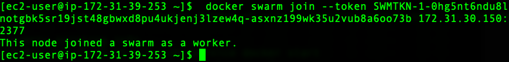
- Upload python scripts package and create the virtual environment as shown in the manager node setup.

Once all your worker nodes are correctly added in the swarm, you can run `docker node ls` command in your manager node and you should see an output like shown below.

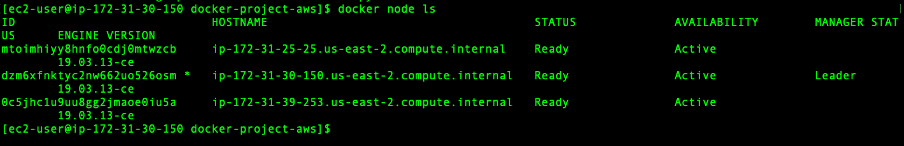

This completes the setup. After this setup, you should have a running Amazon EC2 multi-node swarm cluster which can take tasks and distribute them across worker nodes. Now, we will do the required objectives.

# Task 1: Pull the web application image and test

In this task, we need to pull and run the Docker image *"nclcloudcomputing/javabenchmarkapp"*. We need to perform these tasks using the following methods:

- Command-line interface
- SDK or API

## Using Command Line

The command-line interface can be leveraged using the SSH client of our manager node or a worker node since we are just pulling and loading the image. It can be achieved using below CLI commands.

```bash
#!/bin/bash

# pull the web application container image
docker pull nclcloudcomputing/javabenchmarkapp

# run the web application
docker run -dp 8080:8080 nclcloudcomputing/javabenchmarkapp
```

## Using Docker Python SDK

Similarly, we can achieve a similar task using Docker Python SDK by running the following script in our manager or worker SSH client (inside `docker-project-aws` folder)

```bash
# run python task01 script
python task01.py
```

The script can be download from here: [https://github.com/abhinavcreed13/docker-load-balancer-ec2/blob/main/task01.py](https://github.com/abhinavcreed13/docker-load-balancer-ec2/blob/main/task01.py){:target="_blank"}. 

It uses `client.images.pull` to pull the image and then `client.containers.run` to run the container.

```python
# -- a snippet of task01.py --
# pull image
image = client.images.pull("nclcloudcomputing/javabenchmarkapp")
....
....
# run container
container = client.containers.run("nclcloudcomputing/javabenchmarkapp", 
																		detach=True, 
                                    ports={'8080/tcp':8080})
```

# Task 2: Deploy a multi-service application in a Docker environment

In this task, we need to deploy a multi-service application based on the below architecture.


## Using Command Line

This task can be achieved using the command line interface by leveraging `docker-compose` functionality with stack deployment. We can use the following `docker-compose.yml` for achieving this task:

```yaml
version: "3"
services:
  web:
    image: nclcloudcomputing/javabenchmarkapp
    deploy:
      replicas: 2
      restart_policy:
        condition: on-failure
    ports:
      - "80:8080"   
    networks:
      - webnet
  visualizer:
    image: dockersamples/visualizer:stable
    ports:
      - "88:8080"
    volumes:
      - "/var/run/docker.sock:/var/run/docker.sock"
    deploy:
      placement:
        constraints: [node.role == manager]
    networks:
      - webnet
  mongodb:
    image: mongo:latest
    ports:
      - "3306:27017"
    volumes: 
      - /Users/abhinavcreed/Projects/docker-project/mongo_data:/data/db
    deploy:
      placement:
        constraints: [node.role == manager]
    networks:
      - webnet
networks:
  webnet:
```

This YAML file can then be deployed on the manager node using the following commands.

```yaml
# deploy services
docker stack deploy -c docker-compose.yml cproject 

# show services
docker service ls

# show containers
docker container ls -a 
```

## Using Docker Python SDK

Similarly, we can also use the Docker python SDK to achieve this task. We will be using [https://github.com/abhinavcreed13/docker-load-balancer-ec2/blob/main/task02.py](https://github.com/abhinavcreed13/docker-load-balancer-ec2/blob/main/task02.py){:target="_blank"} python script to deploy this stack which can be provided with command line parameters for enabling more control. This script should be executed on the **manager node** using the below commands.

```yaml
# deploy stack 
python task02.py \
--mode deploy \ 
--mount-mongo /home/ec2-user/docker-project-aws/mongo_data \
--init-swarm False

# display stack
python task02.py \
--mode display
```

In order to deploy stack with SDK, we are using `client.services.create` method with `docker.types.EndpointSpec` and `docker.types.ServiceMode` as shown in the snippet of `task02.py` below.

```python
# -- a snippet of task02.py --
...
...
# specifying service options
es_prime = docker.types.EndpointSpec(ports={80:8080})
sm_prime = docker.types.ServiceMode('replicated',args.replicate)
es_viz = docker.types.EndpointSpec(ports={88:8080})
mount_viz = ["/var/run/docker.sock:/var/run/docker.sock"]
es_mongo = docker.types.EndpointSpec(ports={3306:27017})
mount_mongo = [f"{args.mount_mongo}:/data/db"]
manager = ["node.role == manager"]

# creating the services 
client.services.create('nclcloudcomputing/javabenchmarkapp',name='prime',endpoint_spec=es_prime,mode=sm_prime)
client.services.create('dockersamples/visualizer',name='viz',endpoint_spec=es_viz,constraints=manager,mounts=mount_viz)
client.services.create('mongo',name='mongo',endpoint_spec=es_mongo,constraints=manager,mounts=mount_mongo)
...
...
```

After the stack has been properly deployed, it can be verified using `docker service ls` command by running it on the manager node as shown below.

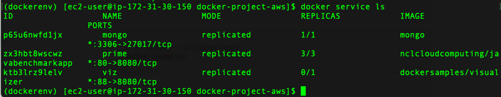

We can also see our stack using docker swarm visualizer which is deployed on HTTP 88 port. It can be accessed from outside using `http://<public-ip-of-manager-node>:88` as shown below.

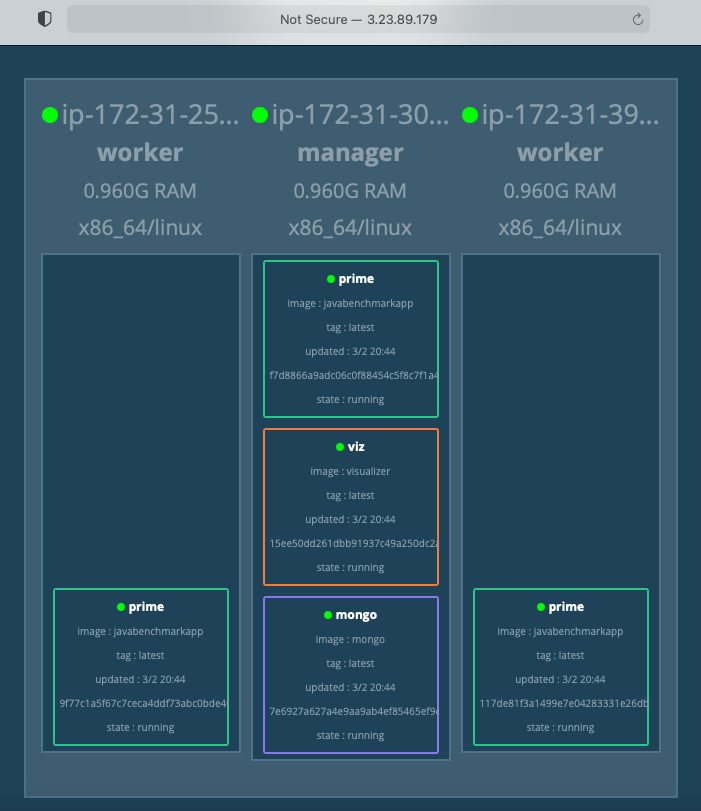

# Task 3: The load generator

A load generator creates a load on the web application by calling its URL multiple times. This could be used to benchmark system performance. In this task, we will create a simple program which puts a load on the web application by calling its URL. The program should accept the following parameters (through command line parameters):

- URL to be called.
- Inter-Request time distribution (Normal, Poisson).
- Mean($\mu$) and standard deviation ($\sigma$) in case of Normal distribution. Lambda($\lambda$) in case of Poisson distribution.
- Number of iterations of URL calls to be done before the program terminates.

This task can be achieved by creating a python script which can take the above-stated parameters using a command line and generate the required load. It can be achieved using the following commands by running it on the manager node.

```python
# Poisson distribution - Inter-Request Arrival of requests
python task03.py \
--url http://localhost:80/primecheck \
--time-dist poisson \
--lamb 1 \
--iter 10

# Normal distribution - Inter-Request Arrival of requests
python task03.py \
--url http://localhost:80/primecheck \
--time-dist normal \
--mu 2 \
--sigma 2 \
--iter 10
```

The implementation of task03.py can be found here: [https://github.com/abhinavcreed13/docker-load-balancer-ec2/blob/main/task03.py](https://github.com/abhinavcreed13/docker-load-balancer-ec2/blob/main/task03.py){:target="_blank"}. 

It is using `urllib.request` to hit the provided URL. In addition, it is using `random.expovariate(args.lamb)` for generating poisson inter-arrival request times and `np.random.normal(args.mu, args.sigma,args.iter)` for generating normal inter-arrival request times.

Upon running the script, we can see how it generates the load on the web application as shown below.

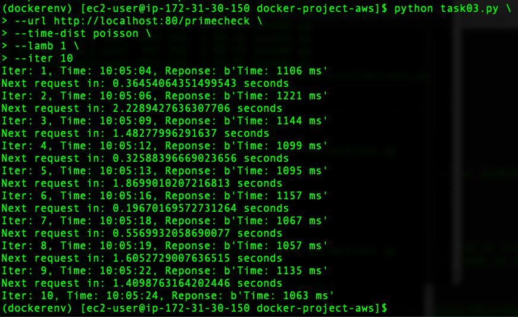

# Task 4: Add a Docker monitoring tool (google/cAdvisor)

In this task, we will be adding a docker monitoring tool by using image - *"google/cadvisor".* This can be achieved by running the command using command-line or SDK. **This tool should be added on all manager and worker nodes for collecting the required statistics of CPU and memory.**

## Using command line

```python
# publish cAdvisor on port 70
docker run \
--volume=/:/rootfs:ro \
--volume=/var/run:/var/run:rw \
--volume=/sys:/sys:ro \
--volume=/var/lib/docker/:/var/lib/docker:ro \
--publish=70:8080 \
--detach=true --rm --name cadvisor google/cadvisor:latest \
--storage_duration=2m0s \
--allow_dynamic_housekeeping=false \
--housekeeping_interval=1s
```

## Using Docker Python SDK

The implementation using python SDK can be found here: [https://github.com/abhinavcreed13/docker-load-balancer-ec2/blob/main/task04.py](https://github.com/abhinavcreed13/docker-load-balancer-ec2/blob/main/task04.py){:target="_blank"}.

```python
# publish cAdvisor on port 70
python task04.py
```

Now, if we generate load using normal or Poisson distribution, it can be seen on cAdvisor UI hosted on HTTP 70 port as shown below.

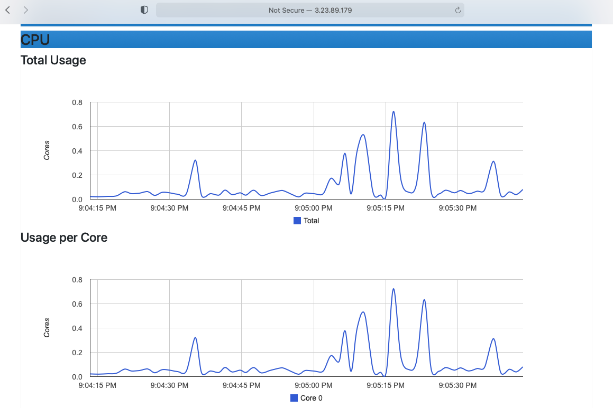

# Task 5: Insert benchmark results into MongoDB database & generate charts using R

Next, we will insert our benchmark results into the MongoDB database as deployed in our stack. We will generate a normal or Poisson distributed request load using different inter-arrival times. This can be easily achieved using our task05.py - [https://github.com/abhinavcreed13/docker-load-balancer-ec2/blob/main/task05.py](https://github.com/abhinavcreed13/docker-load-balancer-ec2/blob/main/task05.py){:target="_blank"} - script as shown below by running on the manager node.

**Note:** make sure google/cAdvisor is also running on worker nodes.

```bash
# manager node
DATABASE=benchmarking2

# use this -> for generating poisson distributed load
python task05.py \
--url http://localhost:80/primecheck \
--time-dist poisson \
--lamb 4 \
--iter 30 \
--database $DATABASE \
--api_url http://localhost:70/api/v1.3/subcontainers/docker/ \
--write-to-file False

# use this -> for generating normal distributed load
python task05.py \
--url http://localhost:80/primecheck \
--time-dist poisson \
--lamb 7 \
--iter 30 \
--database $DATABASE \
--api_url http://localhost:70/api/v1.3/subcontainers/docker/ \
--write-to-file False
```

This script will generate the load and save the recorded statistics from cAdvisor API into the MongoDB database with container names as collections for our manager node.

Similarly, we need to record the stats of our worker nodes. By logging in to the worker node, we can get their stats using the same script with different parameters as shown below. 

```bash
# record stats into the mongodb database of the worker node
# mongo client is the eth0 of manager node
DATABASE=benchmarking2

python task05.py \
--url http://localhost:80/primecheck \
--database $DATABASE \
--api_url http://localhost:70/api/v1.3/subcontainers/docker/ \
--mongo-client 172.31.30.150 \
--simulate-load False \
--write-to-file False
```

Once we have stored all the stats in our chosen database, we can get all the collections of our database using task05-store-collections.py - [https://github.com/abhinavcreed13/docker-load-balancer-ec2/blob/main/task05-store-collections.py](https://github.com/abhinavcreed13/docker-load-balancer-ec2/blob/main/task05-store-collections.py){:target="_blank"} - script and create CPU and memory charts using our graphs.R - [https://github.com/abhinavcreed13/docker-load-balancer-ec2/blob/main/graphs.R](https://github.com/abhinavcreed13/docker-load-balancer-ec2/blob/main/graphs.R){:target="_blank"} - script.

```bash
# run on manager node
# get all collections of our database
python task05-store-collections.py --database $DATABASE

# generate CPU utilization graphs for each container
Rscript graphs.R /home/ec2-user/docker-project/docker-project-aws $DATABASE cpu

# generate memory utilization graphs for each container
Rscript graphs.R /home/ec2-user/docker-project/docker-project-aws $DATABASE memory

# get all graphs back to local machine (run in new terminal window)
scp -i "creed.pem" -r ec2-user@ec2-3-23-89-179.us-east-2.compute.amazonaws.com:docker-project/docker-project-aws/graphics /Users/abhinavcreed/projects/docker-project
```

The graphs are created using `ggplot2` library by connecting with provided MongoDB database. As an example of extracting CPU metrics from the database using R is shown below.

```r
# -- snippet of graphs.R file --
...
...
# extracting cpu data 
cpu = alldata$cpu
# extracting cpu usage 
cpu.usage = cpu$usage
# total cpu usage 
cpu.usage.total = cpu.usage$total
# differences between usages 
delta = diff(cpu.usage.total, lag = 1) 
# calculating core usage 
cores = delta/time.delta
cores = cores/1000000000

# creating dataframe for ggplot
dat = data.frame(cores,times[-1])
names(dat) <- c("cores","time")

# creating the plot object 
g = ggplot(data=dat, aes(x=time,y=cores)) +
  ggtitle(paste("Total Usage of",collections[i]),subtitle=database) +
  geom_line(color=i+1) +
  theme(plot.subtitle = element_text(size=10, face="italic"))
...
...
```

After R script is executed successfully, you should be able to see the following files inside the graphics folder as shown below.

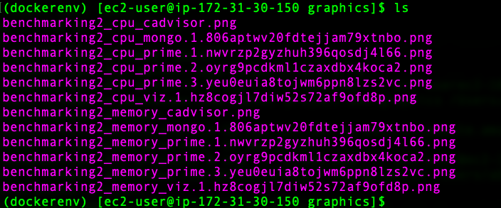

These files are created for CPU and Memory statistics for each of the available containers on the manager and worker nodes. These graphs will show total CPU usage during the generation of the load for each of the application containers as shown below.

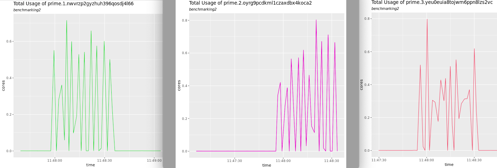

Similarly, they will also show the total memory usage during the generation of the load as shown below.

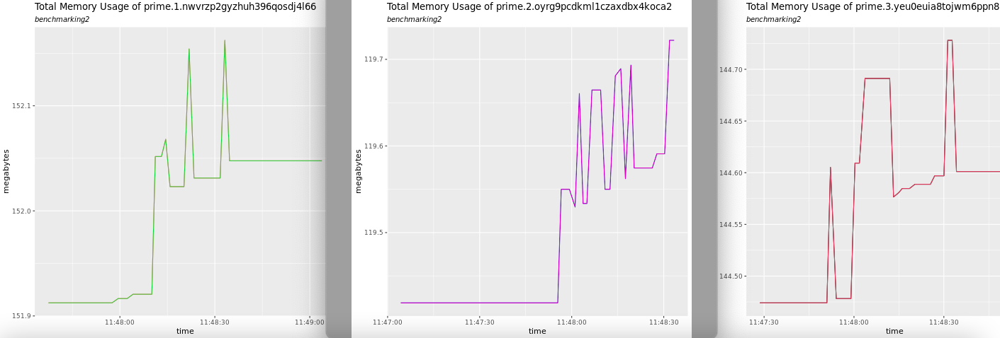

Cheers!

